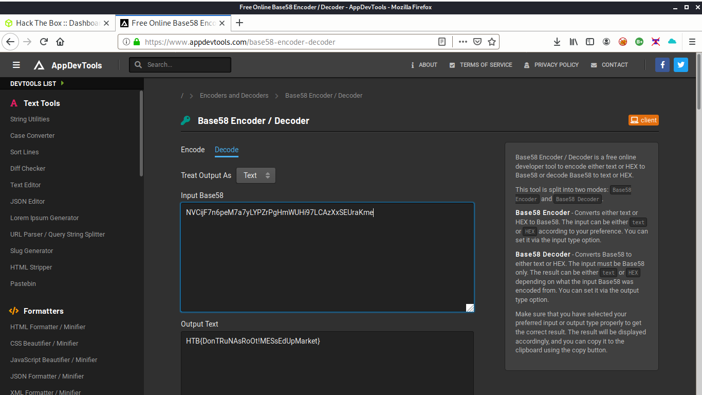

# MarketDump_HTB

Open the file in onkeypress="return event.charCode &gt;= 48 &amp;&amp; event.charCode &lt;= 57" .pcap(packetcapture)

Filter tcp.stream == 1056

https://www.appdevtools.com/base58-encoder-decoder

